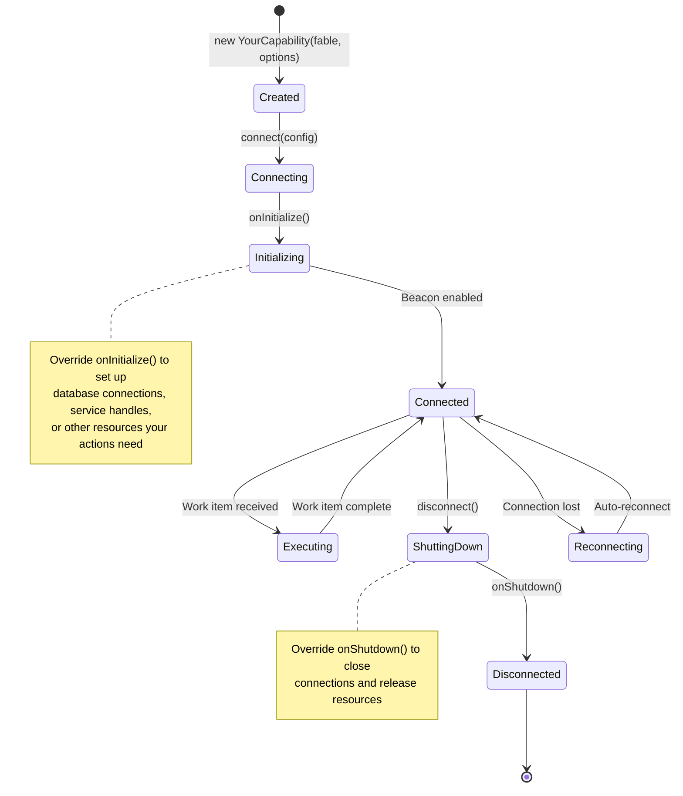

# Architecture

Ultravisor Beacon Capability is a thin convention layer on top of `ultravisor-beacon`. It discovers action methods on your subclass, builds the capability descriptor that `ultravisor-beacon` expects, and delegates all transport and execution to the underlying beacon service.

## Class Hierarchy

<!-- bespoke diagram: edit diagrams/class-hierarchy.mmd or .hints.json, then: npx pict-renderer-graph build modules/fable/ultravisor-beacon-capability/docs -->


## Module Composition

The capability base class composes three internal concerns:

| Component | Source | Responsibility |
|-----------|--------|----------------|
| **ActionMap** | `Ultravisor-Beacon-Capability-ActionMap.cjs` | Discovers `action*` methods on the prototype chain; resolves companion `_Schema` and `_Description` properties; builds bound handlers |
| **UltravisorBeaconCapability** | `Ultravisor-Beacon-Capability.cjs` | Base class; merges discovered and explicit actions; builds the capability descriptor; manages beacon lifecycle |
| **UltravisorBeaconService** | `ultravisor-beacon` (external) | Handles authentication, transport negotiation, polling, heartbeat, work item execution |

## Connect Flow

When you call `connect()`, the following sequence executes:

<!-- bespoke diagram: edit diagrams/connect-flow.mmd or .hints.json, then: npx pict-renderer-graph build modules/fable/ultravisor-beacon-capability/docs -->


## Action Discovery

The `buildActionMap()` function walks the prototype chain of your capability instance to find action methods:

<!-- bespoke diagram: edit diagrams/action-discovery.mmd or .hints.json, then: npx pict-renderer-graph build modules/fable/ultravisor-beacon-capability/docs -->


Key behaviors:
- **Subclass wins** -- If a method name is seen on a derived class, the base class version is skipped
- **Getters supported** -- `_Schema` and `_Description` companions can be ES class getters, plain properties, or methods
- **Bound handlers** -- Each handler is bound to the instance, preserving `this` context for access to services, connections, and state

## Handler Wrapping

The convention-based handler signature differs from the raw `ultravisor-beacon` handler signature. The ActionMap creates a wrapper that bridges the two:

```
Convention (your code):
  actionDoWork(pSettings, pWorkItem, fCallback, fReportProgress)

Raw beacon (what ultravisor-beacon expects):
  Handler(pWorkItem, pContext, fCallback, fReportProgress)

Wrapper (created by ActionMap):
  function(pWorkItem, pContext, fCallback, fReportProgress)
  {
      let tmpSettings = (pWorkItem && pWorkItem.Settings) ? pWorkItem.Settings : {};
      return boundMethod(tmpSettings, pWorkItem, fCallback, fReportProgress);
  }
```

The `pContext` parameter (containing `{ StagingPath }`) is not forwarded because it is unused in practice. If needed, it is available via `this.options.StagingPath` on the capability instance.

## Capability Descriptor

The base class produces a descriptor matching the shape documented in `ultravisor-beacon`'s `CapabilityManager`:

```javascript
{
    Capability: 'YourCapabilityName',
    Name: 'YourCapabilityNameProvider',
    actions:
    {
        'ActionOne':
        {
            Description: 'What it does',
            SettingsSchema: [{ Name: 'Param', DataType: 'String', Required: true }],
            Handler: function (pWorkItem, pContext, fCallback, fReportProgress) { ... }
        },
        'ActionTwo': { ... }
    },
    initialize: function (fCallback) { /* delegates to onInitialize */ },
    shutdown: function (fCallback) { /* delegates to onShutdown */ }
}
```

The `initialize` and `shutdown` functions delegate to `onInitialize()` and `onShutdown()` on your subclass.

## Server-Side Task Registration

When the Ultravisor server receives the beacon registration, its coordinator automatically creates task types for each action:

<!-- bespoke diagram: edit diagrams/server-side-task-registration.mmd or .hints.json, then: npx pict-renderer-graph build modules/fable/ultravisor-beacon-capability/docs -->


Each task type includes:
- **SettingsInputs** derived from the action's `SettingsSchema`
- **EventInputs/Outputs** for graph wiring (Trigger, Complete, Error)
- **StateOutputs** for capturing results (Result, StdOut)

## Lifecycle



## File Layout

```
ultravisor-beacon-capability/
  package.json
  README.md
  source/
    Ultravisor-Beacon-Capability.cjs          # Base class (main export)
    Ultravisor-Beacon-Capability-ActionMap.cjs # Action discovery helper
  test/
    Ultravisor-Beacon-Capability_tests.js     # Mocha TDD tests
  docs/
    README.md                                  # Overview
    _cover.md                                  # Landing page
    _sidebar.md                                # Navigation
    _topbar.md                                 # Top bar
    quickstart.md                              # Step-by-step guide
    architecture.md                            # This file
    api/                                       # API reference
    examples/                                  # Real-world examples
```
